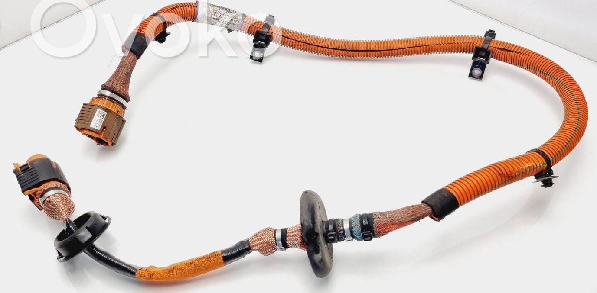
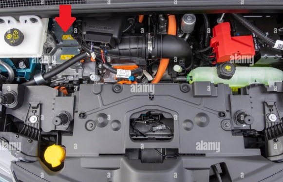
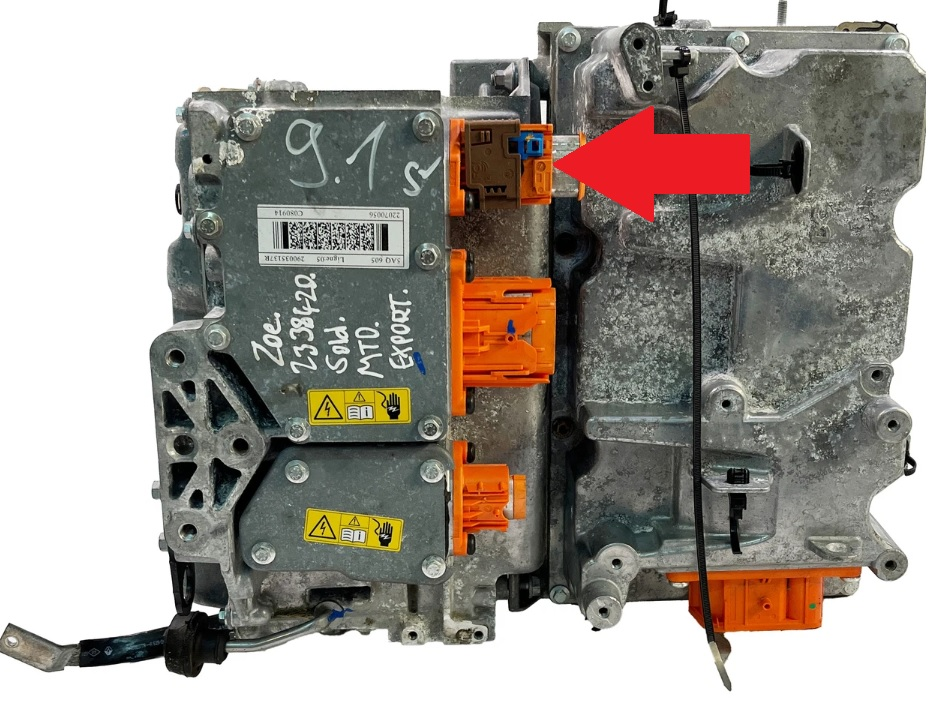
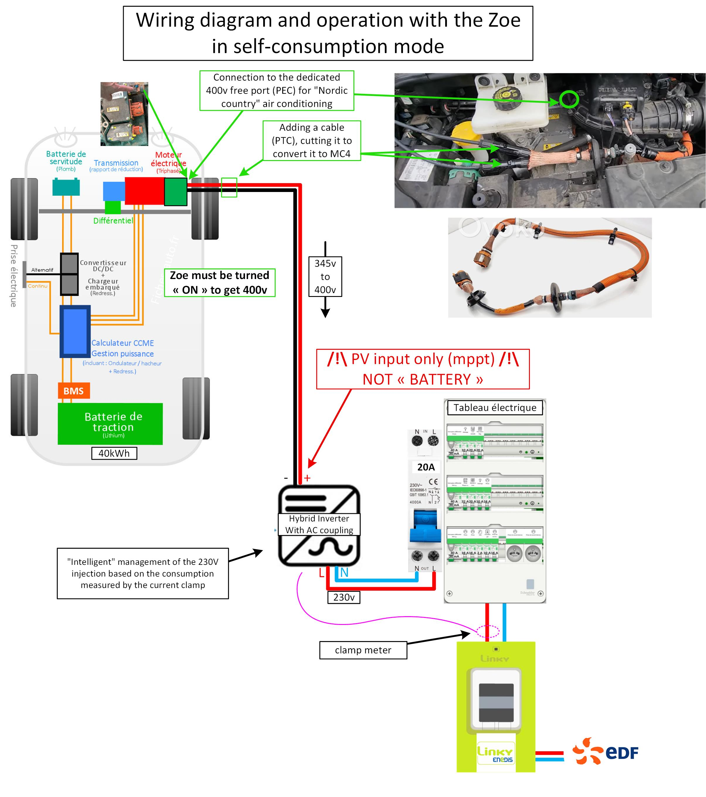

## Renault Zoe used as external battery

# Wiring Diagram and Operation with the Renault Zoe in Self-Consumption Mode (~V2H)

This document explains the wiring diagram and operational logic shown in
the provided schematic for using a **Renault Zoe** as a DC power source
feeding a **hybrid inverter** in self‑consumption mode.

> [!CAUTION]
> /!\ DO NOT plug the T2 cable to charge the vehicule AND MC4 cable to your inverter !!!
> 
> Do not draw more than 3kW from your inverter => your vehicule don't like it :)
> 
> Working with high voltage is dangerous. Always follow local laws and regulations regarding high voltage work. If you are unsure about the rules in your country, consult a licensed electrician for more information.

------------------------------------------------------------------------

## ⚡ Purpose of the System

This setup allows the traction battery of a Renault Zoe (R90 - 40 kWh example
shown) to supply high‑voltage DC (approx. **345--400 V**) to the **PV
input (MPPT)** of a hybrid inverter.\
The inverter then injects controlled power into the home's AC electrical
system based on household consumption.

Important notes: - **PV input only** → *NOT* the battery input of the
inverter.\
- The Zoe must be turned **ON** to supply 400 V. - Intelligent AC
coupling is achieved using a **clamp meter** that monitors consumption.

------------------------------------------------------------------------

## 🔌 High‑Voltage DC Extraction From the Zoe

The connection uses the **dedicated 400V free port (PEC)** intended for
"Nordic country" auxiliary air‑conditioning.

Steps:
- Ensure the Zoe is powered OFF
- Buy a **PTC cable** ~50€, and convert it to **MC4 connectors**:

- Find the PEC inverter in the Zoe:

- Remove the protect plug from PEC inverter

- Connect this cable to the vehicle's 400 V PEC port (location shown in the image).

- Ensure the Zoe is powered ON

- Identify and label the positive and the negative MC4 ports

- Configure your inverter to draw a maximum of 3 kW and as 'zero-injection'

------------------------------------------------------------------------

## 🔋 HV Output to Inverter

The HV line (≈345--400 VDC) is routed: - Through the custom MC4 cable -
Into the **Hybrid Inverter (with AC coupling)**, connected via its **PV
MPPT input**

⚠️ **Warning:**\
Only the MPPT/PV input is compatible with this DC voltage.\
Never connect this HV DC line to the inverter's battery port.\
Or alternatively, you need a system to communicate with the vehicle’s BMS via the CAN bus.

------------------------------------------------------------------------

## 🏠 AC Injection and Home Electrical Panel

The hybrid inverter outputs 230 V AC to the home, protected by a **20A breaker**.

A **current clamp** (tore) is placed at the L grid meter to: - Measure
real‑time household consumption - Allow the inverter to inject only what
is necessary → **"self‑consumption without export"** / **"zero injection"**

------------------------------------------------------------------------

## 📐 Summary of the Workflow

1.  Zoe turned ON → traction battery provides \~400 VDC through the PEC
    connector.
2.  DC enters the inverter via MPPT PV input.
3.  Inverter converts DC → AC (230 V).
4.  Clamp meter ensures power injection matches household demand.
5.  Home electrical panel receives this power without back‑feeding the
    grid.

------------------------------------------------------------------------

## 📷 Included Image

The following image corresponds to the described wiring diagram:

------------------------------------------------------------------------

## ⚠ Safety Disclaimer

Working with: - **400 VDC automotive traction systems** - **High‑voltage
inverters** - **Grid-connected electrical systems**

...is extremely dangerous.\
This document is for **informational purposes only**.\
Installation must be performed by qualified professionals with proper HV
certification.
